# Job Hunt Command Center

**A calm, premium single-page dashboard that runs your day while you hunt for a job** — AI/ML learning, building, revision, reading, DSA practice, focused job applications, and a protected sleep schedule, all in one local-first app.

> _"I know exactly what I should be doing right now"_ — the only feeling this app is allowed to produce.

    

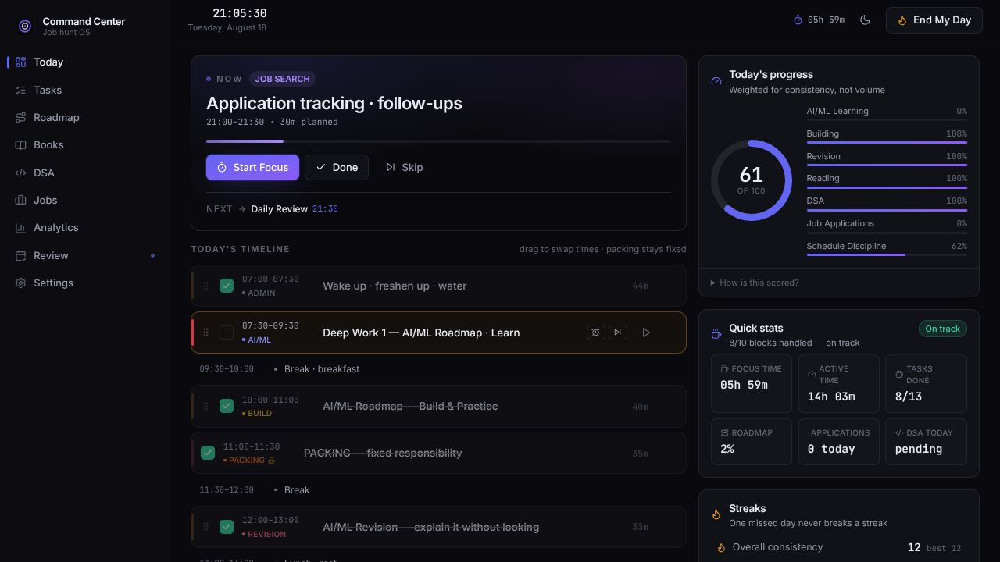

---

## Why I Built This

Unstructured job hunting was quietly destroying my routine:

- waking at 11 AM, sleeping at 3 AM
- 3-day bursts of mass-applying, then 10 days of no learning
- jumping between AI/ML, books, LeetCode, and applications with no system
- zero visibility into where my time actually went

The fix isn't another todo list — it's a **daily operating system** that makes the right day the default day:

> **Learn → Build → Revise → Practice → Apply → Review → Sleep → Repeat.**

The goal: **get a job without destroying the daily routine.**

---

## Product Principles

1. **Morning flow under 2 minutes** — open → *Start My Day* → first task. Nothing to configure.
2. **The schedule is a default, not a cage** — drag, skip, move, extend anything… except packing.
3. **Learning leads** — the score is weighted 45% toward AI/ML learning + building. Applications are capped at a small slice **on purpose**.
4. **Protect sleep** — a late-night guardrail, wind-down block, and sleep target are first-class features.
5. **Consistency > intensity** — score caps at 100, streaks forgive one missed day, nothing rewards 15-hour days.

---

## Features

### 🎯 Today — the home screen
`START MY DAY` records the session, loads the plan, surfaces yesterday's unfinished tasks, streaks, and a big **NOW card** ("what should I be doing right now"). Live clock, focus totals, completion ring, and an **on-track** indicator that compares completed blocks vs. blocks expected by this time.

### 🗓 Daily planner + tasks
Vertical timeline generated from an editable template. Every task supports **start/pause/complete timers**, skip, reschedule, move-to-tomorrow, notes, priority, category, estimated vs. actual duration, partial completion, drag-to-swap times, and **missed-task recovery** (never just a red mark — reschedule, move, or intentionally let go). The **11:00–11:30 packing block is locked and visually protected**, 6 days a week.

### ⏱ Focus timer
Countdown presets (25/45/60/90 + custom), **fullscreen focus mode** with a giant progress ring, per-task live time tracking, gentle completion chime (WebAudio — no assets), optional browser notification, and a **FOCUS SESSION COMPLETE** dialog offering *Take a break / Continue / Mark task complete*.

### 🧭 AI/ML roadmap tracker
Editable, seeded roadmap (Foundations → Math → Classical ML → Deep Learning → Transformers → LLMs/RAG → MLOps → Interview prep → Capstones). Every topic moves through five explicit stages — **Learn · Build · Practice · Revise · Teach myself** — with notes, linked projects, revision status, and a "current topic" pin.

### 📚 Book tracker
One meaningful topic a day. Log book, topic, pages, key concepts, and a one-sentence takeaway — plus the honest flag: **"can I explain it without the book?"**

### 🧩 DSA tracker
One problem a day with difficulty, topic, time, independent/hints flags, and a **main insight** field (revision gold). Ships with an editable **NeetCode 150 checklist** that auto-checks when you log a matching solve. DSA streak front and center.

### 💼 Job application tracker
Company, role, portal, date, status (Saved → Offer/Ghosted), resume version, cover note, follow-up dates, and notes. Counters for **today / this week / interviews / active**, overdue follow-up alerts — and a hard cultural stance: **quality applications > random applications**, enforced by a guarded daily block.

### 📊 Analytics (decision-only)
Focused hours & score trend (14 days), hours-by-area stacked weeks, applications/DSA per week, long-term totals. Every chart answers *"what should I change next week?"* — no vanity metrics.

### 📝 Weekly review + Sunday mode
Sundays automatically switch to **Review · Plan · Light revision**: auto-computed week stats (learning/building/reading hours, DSA x/7, applications, interviews, avg focus, completion %), three honest reflection lines, next week's targets, and a **Generate next week's plan** action that materializes all 7 days and spreads personal tasks across weekdays.

### 🔥 Streaks with grace
Six separate streaks (overall, learning, DSA, reading, revision, routine) with current + best. **A single missed day never breaks a streak** — it just doesn't extend it. Today never counts against you while the day is open.

### 🌙 Guardrails (anti-procrastination, gently)
- **NOW + NEXT indicators** always visible
- **Overrun warning** — "continue or move on?"
- **Job-block guardrail** — "application block is ending… return to learning"
- **Late-night guardrail** — after wind-down: *"Your main workday is complete. Protect tomorrow's energy."* (overridable)
- **Missed-task recovery** instead of red marks

### 🎨 Premium, calm UI
Linear/Vercel-inspired design language — Inter + JetBrains Mono, glass top bar, soft shadows, micro-interactions, progress rings, reduced-motion support, visible focus states, full keyboard access. Dark / light / system themes with 6 switchable accents, persisted.

---

## Daily Workflow

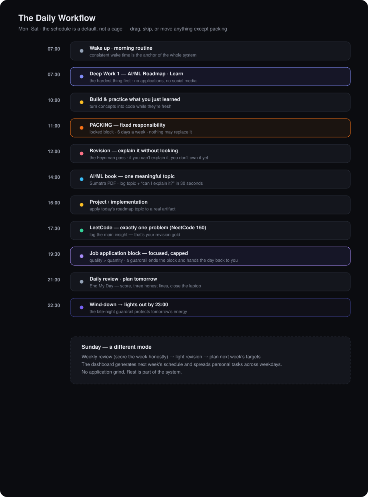

**Night flow:** End My Day → score breakdown → three honest lines → close. Everything is recorded automatically.

---

## The Productivity Loop

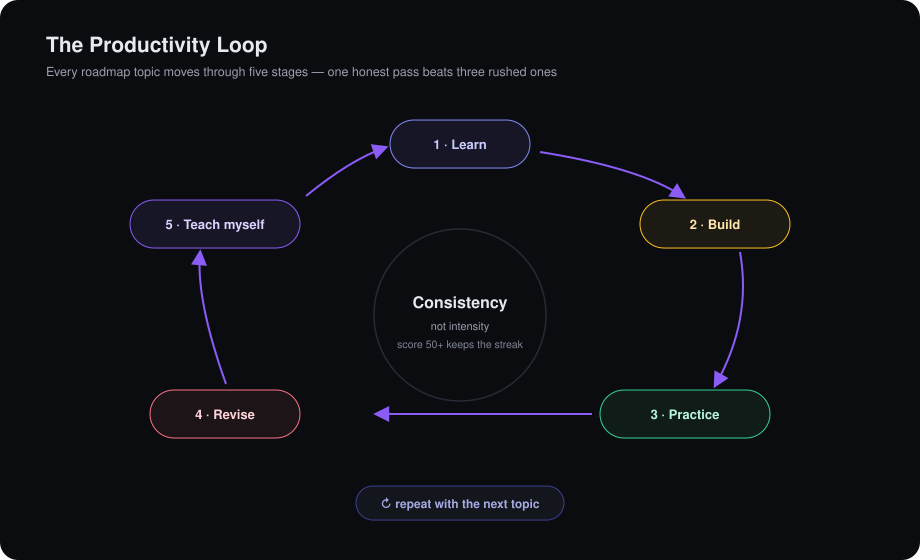

The transparent daily score is weighted toward this loop — **AI/ML learning 25% · building 20% · revision 15% · reading 10% · DSA 10% · applications 10% (capped at your daily target) · schedule discipline 10%.** Sundays re-weight toward review & planning. The formula is shown in-app, on the Today page.

---

## Screenshots

| | |
|---|---|
| 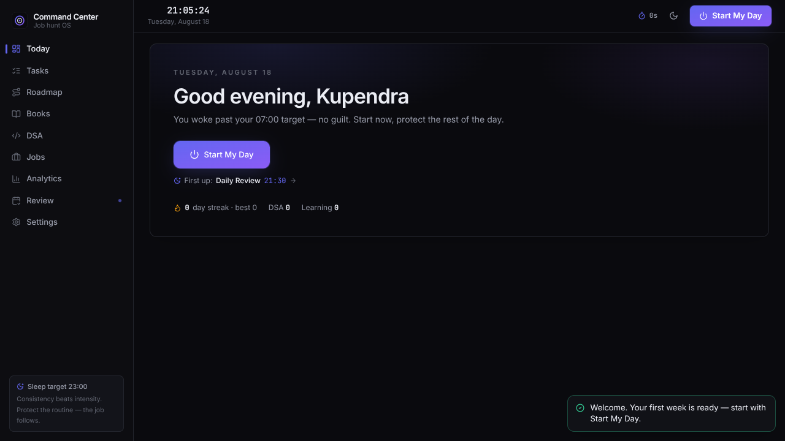 | 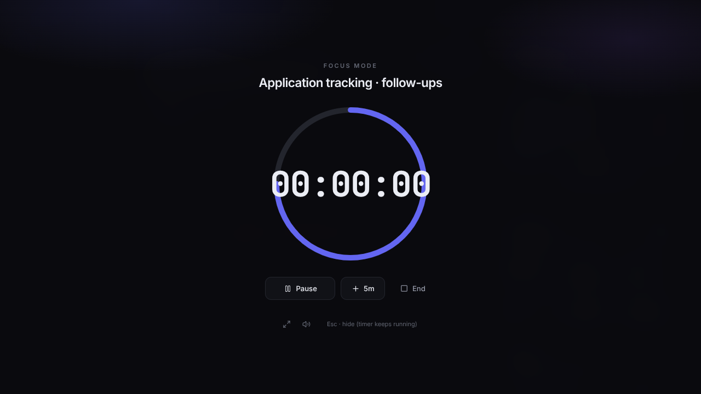 |
| Morning hero — one button, zero friction | Fullscreen focus countdown |
| 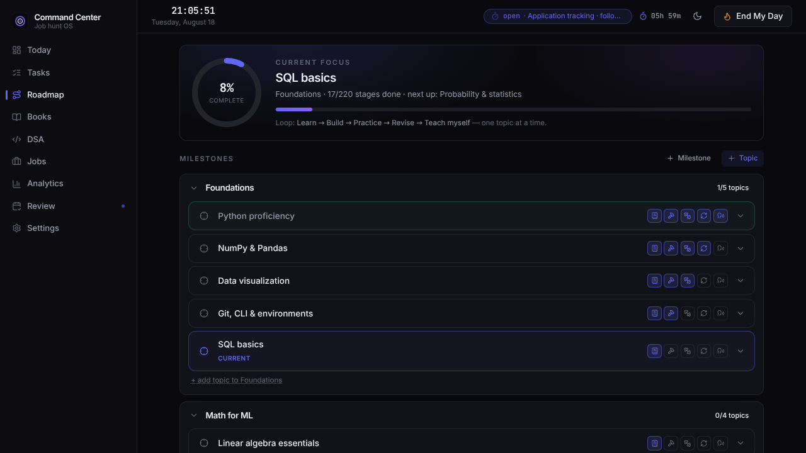 | 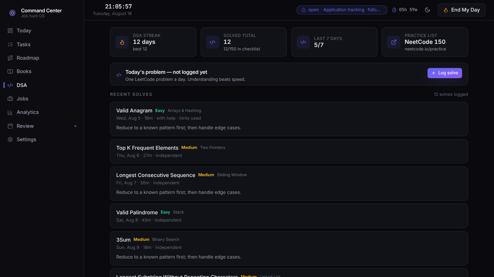 |
| Roadmap stages: Learn → Build → Practice → Revise → Teach | DSA log + NeetCode 150 checklist |
| 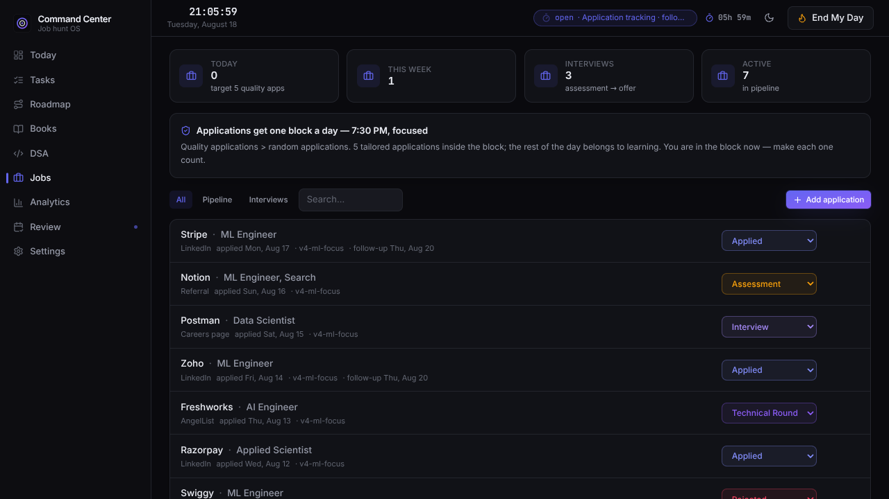 | 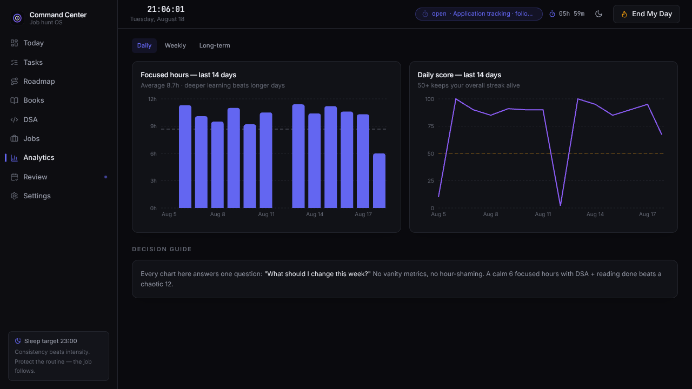 |
| Application pipeline with follow-ups | Decision-focused charts |
| 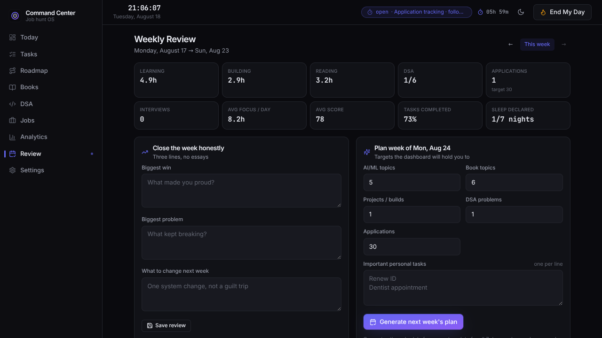 | 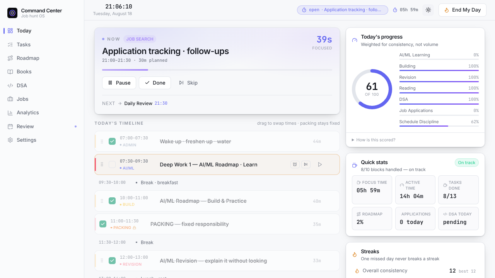 |
| Sunday review & next-week planning | Light mode (also: system-follow) |

<sub>First run shows a 60-second setup wizard:</sub>

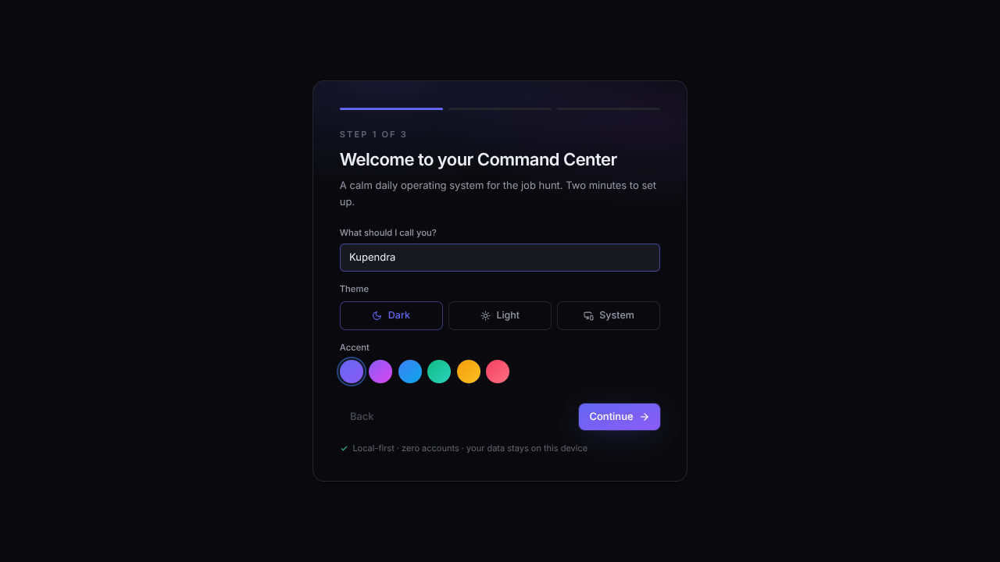

---

## Architecture

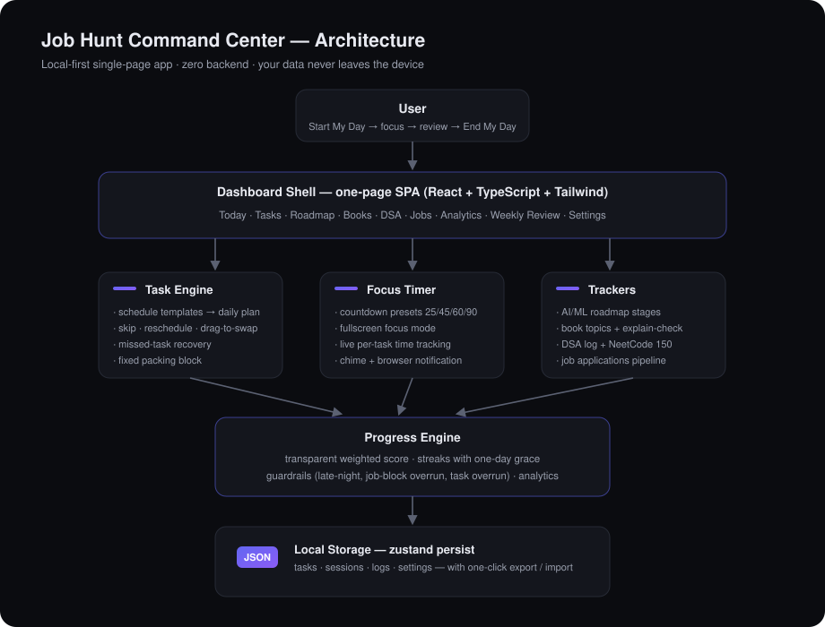

```
src/
├── types.ts                 # the entire data model, one file
├── lib/                     # pure, testable logic
│   ├── time.ts              # HH:mm ⇄ minutes, duration formatting
│   ├── dates.ts             # local dates, week helpers (Monday weeks)
│   ├── defaults.ts          # settings + weekday/Sunday schedule templates
│   ├── schedule.ts          # lazy per-day task generation
│   ├── score.ts             # weighted daily score, streaks, on-track
│   ├── guardrails.ts        # NOW/NEXT, overrun + late-night logic
│   ├── roadmapSeed.ts       # seeded AI/ML roadmap
│   └── neetcode.ts          # seeded NeetCode 150 checklist
├── store/useStore.ts        # zustand store, persisted to localStorage
├── hooks/                   # shared 1s ticker, theme engine, shortcuts
├── components/              # shell + UI primitives + dashboard cards
├── sections/                # Today, Tasks, Roadmap, Books, DSA,
│                            # Jobs, Analytics, Review, Settings, Onboarding
└── tests/core.test.ts       # 21 unit tests for the logic that matters
```

**Data model (summary):** `Task · DaySession · FocusState · RoadmapTopic/Milestone · BookEntry · DsaEntry · JobApp · WeeklyReview · Settings` — all plain JSON, persisted via `zustand/middleware/persist` under one localStorage key, with one-click **export/import** and versioned migrations.

**Key design decision:** days are generated **lazily** from the template the first time you view them. Editing your schedule never rewrites history, and history never blocks the future.

---

## Tech Stack

| Concern | Choice | Why |
|---|---|---|
| UI | React 18 + TypeScript (strict) | type-safe, maintainable |
| Build | Vite 5 | instant DX, tiny prod bundle (~100 KB gzip main) |
| Styling | Tailwind CSS + CSS variables | themeable dark/light/accents |
| State | Zustand + persist | tiny, ergonomic local-first persistence |
| Charts | Recharts (lazy-loaded chunk) | only loaded on the Analytics tab |
| Icons | lucide-react | clean, consistent |
| Dates | date-fns | correct local-time math |
| Fonts | @fontsource Inter + JetBrains Mono | self-hosted, offline, premium |
| Tests | Vitest | fast logic tests |

Zero backend. Zero paid APIs. Nothing leaves your device.

---

## Installation

```bash
git clone https://github.com/kupendrav/job-hunt-command-center.git
cd job-hunt-command-center
npm install
```

## Running Locally

```bash
npm run dev        # → http://localhost:5173
```

Other commands:

```bash
npm run build      # type-check + production build → dist/
npm run preview    # serve the production build locally
npm test           # run the 21 logic tests (vitest)
npm run typecheck  # strict TypeScript check
```

---

## Deployment (free options)

The build output is a static `dist/` folder — host it anywhere for free:

**Vercel** — import the repo at [vercel.com/new](https://vercel.com/new), framework preset **Vite**, deploy.
**Netlify** — build command `npm run build`, publish directory `dist`.
**GitHub Pages** — `npm run build`, publish `dist/` (e.g. via the `actions/deploy-pages` workflow).

> ⚠️ Data lives in each browser's localStorage — the app on Vercel and the app on localhost have separate data. Use **Settings → Export backup** to move between them (or keep one canonical URL).

---

## Keyboard Shortcuts

| Key | Action |
|---|---|
| `Space` | start / pause the focus timer |
| `F` | toggle fullscreen focus mode |
| `N` | show the next task |
| `D` / `T` / `J` / `A` / `R` | Today / Tasks / Jobs / Analytics / Roadmap |
| `Esc` | exit focus mode / close dialogs |

Shortcuts never fire while typing in a field.

---

## Future Improvements

- [ ] Cloud sync (Supabase / GitHub Gist backup) across devices
- [ ] Installable PWA with offline launch
- [ ] Calendar (ICS) export of the daily schedule
- [ ] Roadmap import from a JSON/OPML file
- [ ] Automatic encrypted backups
- [ ] Optional auth for a hosted multi-device version
- [ ] AI weekly coach (local heuristics first, LLM optional)

---

## License

[MIT](LICENSE) — built with discipline, for the job hunt.
